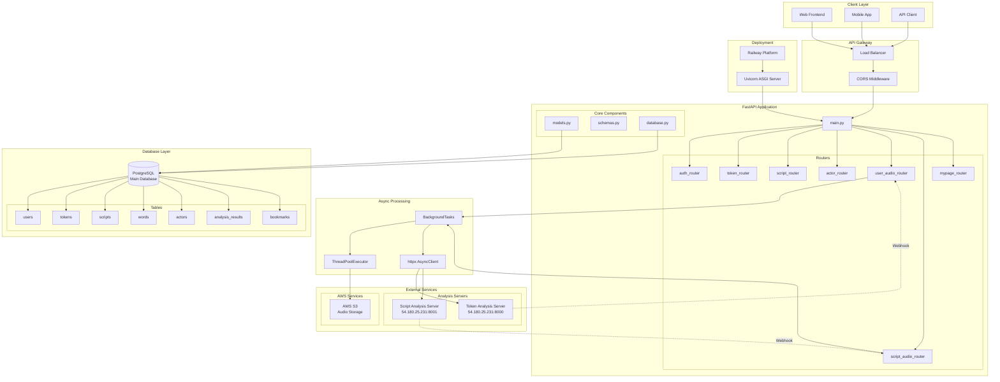
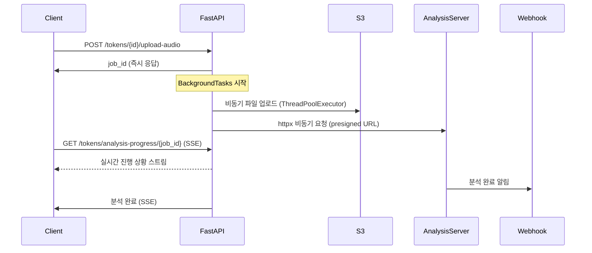
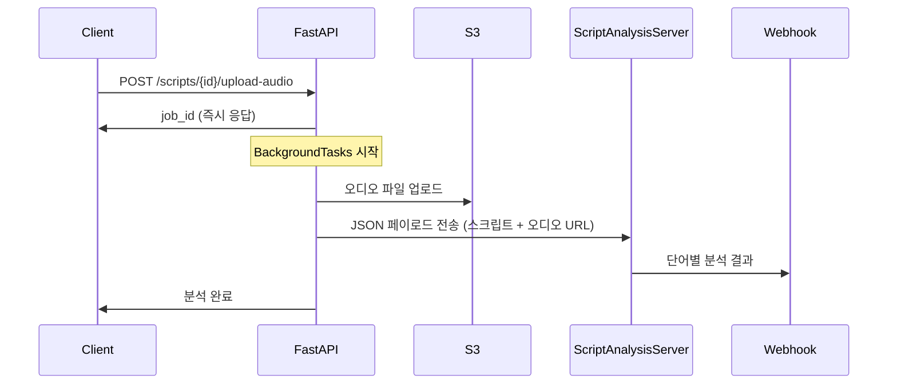

# FastAPI 오디오 분석 시스템 아키텍처

## 🏗️ 시스템 개요

FastAPI와 httpx를 활용한 완전 비동기 오디오 분석 백엔드 서비스입니다. 
토큰 기반 분석과 스크립트 기반 분석을 지원하며, 실시간 진행 상황 추적과 웹훅을 통한 결과 처리를 제공합니다.

## 📐 전체 시스템 아키텍처



## 🏛️ 레이어별 상세 설명

### 1️⃣ Client Layer (클라이언트 계층)
- **Web Frontend**: 웹 브라우저 기반 사용자 인터페이스
- **Mobile App**: iOS/Android 모바일 애플리케이션
- **API Client**: 외부 시스템과의 API 연동

### 2️⃣ API Gateway (API 게이트웨이)
- **Load Balancer**: 트래픽 분산 및 고가용성 보장
- **CORS Middleware**: 크로스 오리진 요청 처리 및 보안

### 3️⃣ FastAPI Application (애플리케이션 계층)

#### 🎯 Main Application
- **main.py**: 애플리케이션 진입점, 라우터 등록, 미들웨어 설정

#### 🛣️ API Routers
- **auth_router** (`/auth`): 사용자 인증 및 권한 관리
- **token_router** (`/tokens`): 토큰 CRUD 작업
- **script_router** (`/scripts`): 스크립트 CRUD 작업
- **actor_router** (`/actors`): 배우 정보 관리
- **user_audio_router** (`/tokens/{id}/upload-audio`): 토큰 기반 음성 분석
- **script_audio_router** (`/scripts/{id}/upload-audio`): 스크립트 기반 음성 분석
- **mypage_router** (`/mypage`): 사용자 개인 페이지

#### 🔧 Core Components
- **models.py**: SQLAlchemy ORM 모델 정의
- **schemas.py**: Pydantic 스키마 정의
- **database.py**: 데이터베이스 연결 및 세션 관리

### 4️⃣ Async Processing (비동기 처리 계층)
- **BackgroundTasks**: FastAPI 백그라운드 작업 처리
- **ThreadPoolExecutor**: I/O 집약적 작업의 비동기 처리 (S3 업로드)
- **httpx AsyncClient**: 외부 API 비동기 HTTP 클라이언트

### 5️⃣ External Services (외부 서비스 계층)

#### ☁️ AWS Services
- **AWS S3**: 오디오 파일 저장소, presigned URL 활용

#### 🔬 Analysis Servers
- **Token Analysis Server** (54.180.25.231:8000): 토큰 기반 음성 분석
- **Script Analysis Server** (54.180.25.231:8001): 스크립트 기반 음성 분석

### 6️⃣ Database Layer (데이터베이스 계층)

#### 🗄️ PostgreSQL Database
주요 테이블 구조:
- **users**: 사용자 정보
- **tokens**: 토큰 데이터 (배우, 영화 정보 포함)
- **scripts**: 스크립트 데이터
- **words**: 스크립트 단어별 상세 정보 (MFCC, 시간 정보)
- **actors**: 배우 정보
- **analysis_results**: 분석 결과 저장
- **bookmarks**: 사용자 북마크

### 7️⃣ Deployment (배포 계층)
- **Railway Platform**: 클라우드 배포 플랫폼
- **Uvicorn**: ASGI 서버 (비동기 웹 서버)

## 🔄 주요 데이터 플로우

### 음성 분석 프로세스 (Token 기반)



### 스크립트 분석 프로세스



## 🛠️ 기술 스택

### Backend Framework
- **FastAPI**: 현대적이고 빠른 웹 프레임워크
- **Uvicorn**: ASGI 서버
- **Python 3.9+**: 프로그래밍 언어

### Database
- **PostgreSQL**: 메인 데이터베이스
- **SQLAlchemy**: ORM (Object-Relational Mapping)
- **Alembic**: 데이터베이스 마이그레이션

### Async & HTTP
- **httpx**: 완전 비동기 HTTP 클라이언트
- **asyncio**: 비동기 프로그래밍
- **ThreadPoolExecutor**: 멀티스레딩

### Cloud Services
- **AWS S3**: 파일 저장소
- **Railway**: 배포 플랫폼

### Data Processing
- **Pydantic**: 데이터 검증 및 직렬화
- **JSON**: 데이터 교환 형식

## 🔐 보안 및 인증

### CORS 설정
```python
app.add_middleware(
    CORSMiddleware,
    allow_origins=["*"],
    allow_credentials=True,
    allow_methods=["*"],
    allow_headers=["*"],
)
```

### 환경 변수 관리
- AWS 자격 증명
- 데이터베이스 연결 정보
- 외부 서비스 URL
- 웹훅 URL

## 📊 성능 최적화

### 비동기 처리
- **완전 비동기 I/O**: httpx, asyncio 활용
- **백그라운드 작업**: 사용자 응답 지연 최소화
- **스레드 풀**: I/O 집약적 작업 병렬 처리

### 데이터베이스 최적화
- **인덱스 활용**: 주요 검색 필드에 인덱스 설정
- **관계 최적화**: joinedload를 통한 N+1 쿼리 방지
- **연결 풀링**: SQLAlchemy 연결 풀 활용

### 캐싱 전략
- **S3 presigned URL**: 직접 업로드로 서버 부하 감소
- **JSON 응답 캐싱**: 자주 조회되는 데이터 캐싱

## 🚀 확장성 고려사항

### 수평 확장
- **무상태 설계**: 세션 정보를 데이터베이스에 저장
- **로드 밸런싱**: 여러 인스턴스 간 트래픽 분산

### 마이크로서비스 아키텍처
- **도메인별 라우터 분리**: 독립적인 배포 가능
- **외부 분석 서버**: 분석 로직의 독립적 확장

### 모니터링 및 로깅
- **구조화된 로깅**: JSON 형태의 로그
- **헬스 체크**: `/health` 엔드포인트
- **메트릭 수집**: 성능 모니터링

## 🔮 향후 개선 계획

### 단기 계획
- [ ] 인증/권한 시스템 강화
- [ ] 멀티파트 대용량 파일 업로드 지원
- [ ] 분석 결과 캐싱 시스템

### 중기 계획
- [ ] Redis 캐싱 도입
- [ ] 메시지 큐 시스템 (Celery/RQ)
- [ ] API 버저닝

### 장기 계획
- [ ] 마이크로서비스 완전 분리
- [ ] Kubernetes 배포
- [ ] 실시간 알림 시스템 (WebSocket)

---

## 📝 문서 정보

- **작성일**: 2025-07-08
- **버전**: 1.0.0
- **작성자**: FastAPI 개발팀
- **최종 수정**: 2025-07-08

이 문서는 FastAPI 오디오 분석 시스템의 전체 아키텍처를 설명합니다. 
시스템 이해와 개발에 참고하시기 바랍니다.
