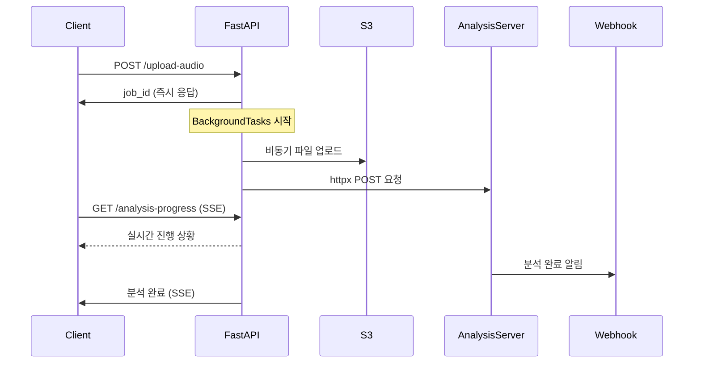

# FastAPI 오디오 분석 서비스 - 현재 구현 상태

## 📋 현재 구현 완료된 기능

### 1. 핵심 아키텍처
- **FastAPI 기반 REST API 서버**
- **PostgreSQL 데이터베이스** (SQLAlchemy ORM)
- **AWS S3 파일 저장소** (boto3)
- **완전 비동기 처리** (httpx + BackgroundTasks)

### 2. 데이터베이스 모델
```python
# 주요 테이블들
- Token: 토큰 정보 (배우, 시간, S3 URL 등)
- AnalysisResult: 분석 작업 상태 및 결과 저장
- User: 사용자 정보 (Google OAuth 지원)
- Script/ScriptWord: 스크립트 및 단어 단위 데이터
- Actor/ActorAlias: 배우 정보 및 별칭
- Bookmark: 사용자 북마크
```

### 3. 현재 오디오 분석 워크플로우

#### 3.1 API 엔드포인트
```
POST /tokens/{token_id}/upload-audio
GET  /tokens/analysis-result/{job_id}
GET  /tokens/analysis-progress/{job_id}  # SSE 스트림
POST /tokens/webhook/analysis-complete
```

#### 3.2 처리 흐름


### 4. 현재 기술 스택
- **FastAPI**: 웹 프레임워크
- **httpx**: 비동기 HTTP 클라이언트
- **boto3**: AWS S3 연동
- **SQLAlchemy**: ORM
- **PostgreSQL**: 메인 데이터베이스
- **ThreadPoolExecutor**: S3 업로드 비동기 처리
- **Server-Sent Events**: 실시간 진행 상황

### 5. 구현된 주요 기능들

#### 5.1 인증 시스템
- Google OAuth 2.0 로그인
- JWT 토큰 기반 인증
- 사용자 프로필 관리

#### 5.2 오디오 분석 시스템
- 멀티파트 파일 업로드
- S3 비동기 업로드 (ThreadPoolExecutor)
- 외부 분석 서버와의 httpx 통신
- 실시간 진행 상황 추적 (SSE)
- 웹훅 기반 결과 수신

#### 5.3 데이터 관리
- 토큰/스크립트 CRUD
- 배우 정보 관리
- 사용자 북마크 시스템
- 분석 결과 저장 및 조회

## 🔧 현재 구현의 특징

### 장점
1. **완전 비동기 처리**: httpx와 BackgroundTasks로 논블로킹 처리
2. **실시간 피드백**: SSE를 통한 진행 상황 스트리밍
3. **확장 가능한 구조**: 모듈화된 라우터 구조
4. **안정적인 데이터 저장**: PostgreSQL + SQLAlchemy
5. **클라우드 연동**: AWS S3 통합

### 현재 한계점
1. **직접 HTTP 통신**: 분석 서버와 직접 httpx 통신
2. **단일 서버 의존**: 분석 서버 장애 시 전체 시스템 영향
3. **스케일링 제한**: 동시 처리 작업 수 제한
4. **재시도 메커니즘 부족**: 실패 시 수동 재처리 필요
5. **작업 우선순위 없음**: FIFO 방식만 지원

## 📁 현재 프로젝트 구조
```
fast-api/
├── back-end/
│   ├── main.py                    # FastAPI 앱 진입점
│   ├── models.py                  # SQLAlchemy 모델들
│   ├── schemas.py                 # Pydantic 스키마
│   ├── database.py                # DB 연결 설정
│   ├── dependencies.py            # 의존성 주입
│   ├── requirements.txt           # 패키지 의존성
│   ├── .env                       # 환경 변수
│   ├── migrations/                # Alembic 마이그레이션
│   ├── services/                  # 비즈니스 로직
│   └── router/
│       ├── auth_router.py         # 인증 관련 API
│       ├── user_audio_router.py   # 오디오 분석 API ⭐
│       ├── token_router.py        # 토큰 관리 API
│       ├── script_router.py       # 스크립트 API
│       ├── actor_router.py        # 배우 관리 API
│       ├── mypage_router.py       # 마이페이지 API
│       ├── script_audio_router.py # 스크립트 오디오 API
│       └── url_router.py          # URL 관리 API
├── docs/                          # 문서화
└── README.md
```

## 🚀 현재 배포 환경
- **플랫폼**: Railway
- **데이터베이스**: PostgreSQL (Railway 제공)
- **파일 저장소**: AWS S3
- **도메인**: yousync-fastapi-production.up.railway.app

## 📊 현재 성능 특성
- **동시 처리**: BackgroundTasks 기반 (제한적)
- **응답 시간**: 즉시 job_id 반환 (비동기 처리)
- **파일 업로드**: ThreadPoolExecutor로 최적화
- **실시간 추적**: SSE 스트림 (3초 간격 폴링)
- **에러 처리**: 기본적인 예외 처리 및 로깅

## 🔍 모니터링 및 로깅
- **로깅**: Python logging 모듈
- **상태 추적**: AnalysisResult 테이블
- **헬스체크**: `/health` 엔드포인트
- **API 문서**: Swagger UI (`/docs`)

---

*이 문서는 2025년 7월 10일 기준 현재 구현 상태를 정리한 것입니다.*
