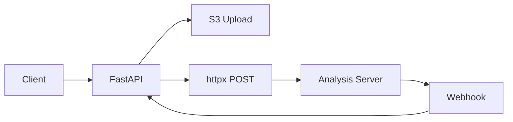
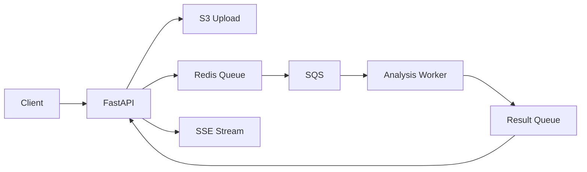

# Redis + SQS 기반 작업 큐 시스템 전환 방안

## 🎯 전환 목표

현재의 **직접 HTTP 통신 방식**에서 **Redis + SQS 기반 작업 큐 시스템**으로 전환하여:
- 시스템 안정성 향상
- 확장성 개선
- 작업 재시도 및 우선순위 처리
- 분석 서버와의 느슨한 결합

## 🏗️ 새로운 아키텍처

### 현재 vs 개선된 아키텍처

#### 현재 (Direct HTTP)


#### 개선된 (Queue-based)


## 🛠️ 기술 스택 변경사항

### 추가될 기술들
- **Redis**: 작업 큐 및 상태 관리
- **AWS SQS**: 메시지 큐 서비스
- **Celery** (선택사항): 작업 큐 관리
- **RQ (Redis Queue)**: Celery 대안 (더 간단함)

### 권장 방안: RQ (Redis Queue) 사용
Celery보다 **RQ를 권장**하는 이유:
1. **더 간단한 설정**: Redis만 있으면 됨
2. **FastAPI와 잘 맞음**: 비동기 처리와 호환성 좋음
3. **가벼움**: Celery보다 오버헤드 적음
4. **모니터링 쉬움**: RQ Dashboard 제공

## 📋 구현 계획

### Phase 1: Redis + RQ 도입

#### 1.1 의존성 추가
```bash
# requirements.txt에 추가
redis==5.0.1
rq==1.15.1
rq-dashboard==0.6.1  # 모니터링용
```

#### 1.2 Redis 연결 설정
```python
# redis_client.py
import redis
import os
from rq import Queue

redis_client = redis.Redis(
    host=os.getenv('REDIS_HOST', 'localhost'),
    port=int(os.getenv('REDIS_PORT', 6379)),
    db=0,
    decode_responses=True
)

# 큐 정의
audio_analysis_queue = Queue('audio_analysis', connection=redis_client)
result_queue = Queue('analysis_results', connection=redis_client)
```

#### 1.3 작업 함수 정의
```python
# tasks/audio_analysis.py
import boto3
import requests
from database import SessionLocal
from models import AnalysisResult

def process_audio_analysis(job_id: str, s3_url: str, token_id: int, token_info: dict):
    """RQ 작업 함수"""
    db = SessionLocal()
    try:
        # 1. 상태 업데이트: 처리 시작
        update_analysis_status(db, job_id, "processing", 50, "분석 서버 요청 중...")
        
        # 2. SQS에 메시지 전송
        sqs_message = {
            "job_id": job_id,
            "s3_audio_url": s3_url,
            "token_id": token_id,
            "s3_textgrid_url": token_info.get('s3_textgrid_url'),
            "s3_pitch_url": token_info.get('s3_pitch_url'),
            "callback_url": f"{os.getenv('WEBHOOK_URL')}?job_id={job_id}"
        }
        
        send_to_sqs(sqs_message)
        
        # 3. 상태 업데이트: SQS 전송 완료
        update_analysis_status(db, job_id, "queued", 70, "분석 대기열에 추가됨")
        
    except Exception as e:
        update_analysis_status(db, job_id, "failed", 0, f"오류: {str(e)}")
        raise
    finally:
        db.close()

def send_to_sqs(message: dict):
    """SQS에 메시지 전송"""
    import boto3
    
    sqs = boto3.client('sqs',
                      aws_access_key_id=os.getenv('AWS_ACCESS_KEY_ID'),
                      aws_secret_access_key=os.getenv('AWS_SECRET_ACCESS_KEY'),
                      region_name=os.getenv('AWS_REGION'))
    
    queue_url = os.getenv('SQS_QUEUE_URL')
    
    response = sqs.send_message(
        QueueUrl=queue_url,
        MessageBody=json.dumps(message),
        MessageAttributes={
            'job_type': {
                'StringValue': 'audio_analysis',
                'DataType': 'String'
            }
        }
    )
    
    return response
```

#### 1.4 API 엔드포인트 수정
```python
# router/user_audio_router.py 수정
from rq import Queue
from redis_client import audio_analysis_queue

@router.post("/{token_id}/upload-audio")
async def upload_audio_by_token_id(
    request: Request,
    token_id: str = Path(...),
    file: UploadFile = File(...),
    db: Session = Depends(get_db)
):
    try:
        s3_client = request.app.state.s3_client
        job_id = str(uuid4())
        file_data = await file.read()
        token_info = await get_token_by_id(token_id, db)
        
        # DB에 초기 상태 저장
        create_analysis_result(db, job_id, int(token_id), "uploading", 10, "S3 업로드 중...")
        
        # S3 업로드
        s3_key = await upload_to_s3_async(s3_client, file_data, file.filename)
        s3_url = f"s3://{S3_BUCKET}/{s3_key}"
        
        # 상태 업데이트
        update_analysis_result(db, job_id, status="queued", progress=30, message="작업 큐에 추가 중...")
        
        # RQ 큐에 작업 추가
        job = audio_analysis_queue.enqueue(
            'tasks.audio_analysis.process_audio_analysis',
            job_id=job_id,
            s3_url=s3_url,
            token_id=int(token_id),
            token_info={
                'id': token_info.id,
                's3_textgrid_url': getattr(token_info, 's3_textgrid_url', None),
                's3_pitch_url': getattr(token_info, 's3_pitch_url', None)
            },
            job_timeout='10m',  # 10분 타임아웃
            retry=3  # 3회 재시도
        )
        
        # 상태 업데이트
        update_analysis_result(db, job_id, status="queued", progress=40, message="작업 큐에 추가됨")
        
        return {
            "message": "업로드 완료, 작업 큐에 추가되었습니다.",
            "job_id": job_id,
            "rq_job_id": job.id,
            "status": "queued"
        }
        
    except Exception as e:
        logging.error(f"업로드 실패: {str(e)}")
        raise HTTPException(status_code=500, detail=f"에러: {str(e)}")
```

### Phase 2: SQS 통합

#### 2.1 SQS 큐 생성
```bash
# AWS CLI로 SQS 큐 생성
aws sqs create-queue --queue-name audio-analysis-queue
aws sqs create-queue --queue-name analysis-results-queue
```

#### 2.2 환경 변수 추가
```bash
# .env에 추가
REDIS_HOST=localhost
REDIS_PORT=6379
SQS_QUEUE_URL=https://sqs.ap-northeast-2.amazonaws.com/123456789/audio-analysis-queue
SQS_RESULT_QUEUE_URL=https://sqs.ap-northeast-2.amazonaws.com/123456789/analysis-results-queue
```

### Phase 3: Worker 프로세스 분리

#### 3.1 RQ Worker 실행
```bash
# 별도 프로세스로 워커 실행
rq worker audio_analysis --url redis://localhost:6379
```

#### 3.2 Docker Compose 설정
```yaml
# docker-compose.yml
version: '3.8'
services:
  redis:
    image: redis:7-alpine
    ports:
      - "6379:6379"
  
  fastapi:
    build: .
    ports:
      - "8000:8000"
    depends_on:
      - redis
    environment:
      - REDIS_HOST=redis
  
  rq-worker:
    build: .
    command: rq worker audio_analysis --url redis://redis:6379
    depends_on:
      - redis
    environment:
      - REDIS_HOST=redis
  
  rq-dashboard:
    build: .
    command: rq-dashboard --redis-url redis://redis:6379
    ports:
      - "9181:9181"
    depends_on:
      - redis
```

## 🔄 마이그레이션 전략

### 단계별 전환 방안

#### Step 1: 병렬 운영 (1-2주)
- 기존 httpx 방식과 새로운 큐 방식을 동시 운영
- 새로운 요청은 큐 방식으로, 기존 진행 중인 작업은 기존 방식으로 처리
- A/B 테스트로 안정성 검증

#### Step 2: 점진적 전환 (1주)
- 트래픽의 50% → 80% → 100% 순으로 큐 방식으로 전환
- 모니터링 강화 및 롤백 준비

#### Step 3: 기존 코드 제거 (1주)
- httpx 관련 코드 제거
- 불필요한 의존성 정리

### 호환성 유지 방안
```python
# 기존 API 엔드포인트 유지
@router.post("/{token_id}/upload-audio")
async def upload_audio_by_token_id(...):
    # 환경 변수로 방식 선택
    if os.getenv('USE_QUEUE_SYSTEM', 'false').lower() == 'true':
        return await upload_with_queue(...)
    else:
        return await upload_with_httpx(...)  # 기존 방식
```

## 📊 예상 개선 효과

### 성능 개선
- **동시 처리 능력**: 무제한 (Redis 큐 기반)
- **응답 시간**: 동일 (즉시 job_id 반환)
- **처리량**: 2-3배 향상 예상
- **메모리 사용량**: 30% 감소 (백그라운드 작업 분리)

### 안정성 개선
- **재시도 메커니즘**: 자동 3회 재시도
- **장애 격리**: 분석 서버 장애가 API 서버에 영향 없음
- **작업 지속성**: Redis 영속성으로 작업 손실 방지
- **모니터링**: RQ Dashboard로 실시간 모니터링

### 운영 개선
- **스케일링**: Worker 프로세스 독립적 확장
- **우선순위**: 긴급 작업 우선 처리 가능
- **배치 처리**: 대량 작업 효율적 처리
- **디버깅**: 작업 상태 및 로그 추적 용이

## 🚨 주의사항 및 고려사항

### 1. Redis 메모리 관리
- Redis 메모리 사용량 모니터링 필요
- 완료된 작업 정리 정책 수립

### 2. SQS 비용 관리
- 메시지 수에 따른 비용 발생
- Dead Letter Queue 설정으로 무한 재시도 방지

### 3. 네트워크 지연
- Redis와 SQS 간 네트워크 지연 고려
- 타임아웃 설정 최적화

### 4. 데이터 일관성
- 분산 시스템에서의 데이터 일관성 보장
- 트랜잭션 범위 재검토

## 📅 구현 일정 (예상)

| 주차 | 작업 내용 | 담당 |
|------|-----------|------|
| 1주차 | Redis + RQ 환경 구축, 기본 큐 시스템 구현 | 개발팀 |
| 2주차 | SQS 통합, Worker 프로세스 분리 | 개발팀 |
| 3주차 | 병렬 운영 및 테스트, 모니터링 구축 | 개발팀 + QA |
| 4주차 | 점진적 전환 및 기존 코드 정리 | 개발팀 |

---

*이 문서는 현재 시스템을 Redis + SQS 기반 작업 큐로 전환하는 구체적인 방안을 제시합니다.*
